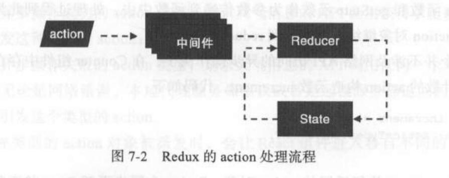

[toc]

# Redux的基本原则
    1. 唯一数据源
    2. 保持状态只读
    3. 数据改变只能通过纯函数完成

## 容器组件和木偶组件
在 Redux框架下，一个Reactz组件基本上就是要完成以下两个功能:

   - 和 Redux Store打交道,读取Store的状态,用于初始化组件的状态，同时还要监听 Store的状态改变;当Store状态发生变化时，需要更新组件状态，从而驱动组件重新渲染;当需要更新Store状态时,就要派发action对象；
   - 根据当前Props和state,渲染出用户界面

**我们将一个任务拆分成两个组件,然后两个组件嵌套起来,完成原本一个组件完成的所有任务**。
- 与 Redux Store打交道的组件,处于外层，所以被叫做 ==容器组件==
- 对于只专心负责渲染界面的组件，处于内层,叫做==展示组件==或称为木偶组件

# React和Redux应用规范和要点

## 模块化应用要点
  - 代码文件的组织结构
  -  确定模块的边界
  - store的状态树

## 代码文件的组织方式
### 按角色组织

MVC中，应用代码分为 Controller Model View ，分别代表 种模块角色，就是把所有的 Con oller 代码放在 controllers 目录下，把所有的 Model 代码放在 models录下，把View 代码放在 views 目录下 这种组织代码的方式，叫做“按角色组织”
### 按功能组织
把完成同一应用功能的代码放在一个目录下,一个应用功能包含多个角色的代码。在Redux中，不同的角色就是reducer、actions和视图，而应用功能对应的就是用户界面上的交互模块。
```
todoList/
    actons.js
    actionTypes.jS
    index.js
    reducer.js
    views/
        cornponent.js
        container.js
filter/
    actions.js
    actionTypes.js
    index. js
    reducer.js
    views/
        cornponent.js
        container.js 
```
- actionTypes.js 定义action类型;
- actions.js 定义action构造函数,决定了这个功能模块可以接受的动作;
- reducer.js 定义了这个功能模块如何相应actions.js 中定义的动作;
- views目录,包含这个功能模块中所以React组件
-  index.js 文件的统一入口

## 模块接口
我下面我们以功能模块todoList和filter，为例。
当我们在filter模块想要使用todoList的action构造函数和视图该如何导入呢?
**bad**
```
import * as actions from '../todoList/actions';
import container as TodoList from './todoList/views/container';
```
因为filter模块依赖todoList模块的内部结构。
**Good**
在 todoList/index.js中,代码如下:
```
import * as actions from './action.js'
import reducer from './reducer.js'
import view from './views/container.js'

export {actions,reducer,view}

//下面在filter模块导入todoList的代码
import {actions,reducer,view as TodoList} from '../todoList';
```
## 状态树的设计
   -   一个模块控制一个状态节点
   -   避免冗余数据
   -   树形结构扁平
 
**一个模块控制一个状态节点**
    Store上的每个state只能通过reducer来更改,而每个reducer只能更改redux状态树上一个节点下的数据。


# React组件在React-redux中性能优化
react 在渲染数据时采用的"浅层比较"的方式只看这两个prop是不是同一个对象的引用。
## 样式写法优化
**Bad**
```
<Todo style={{color:'red'}}/>
```
**Good**
```
//确保初始化只执行一次,不要放到render中
const fooStyle={color:'red'};

<Foo style={fooStyle}/>
```
## props 函数传递方式
**Bad**
```
<TodoItem
    key={item.id}
    text={item.text}
    completed={item.completed}
    onToggle={()=>{ onToggleTodo(item.id)}}
    onRemove={()=>onRemoveTodo(item.id)}
 />
```
上面的做法中，我们将回调函数传递给子组件的onClick事件，redux认为每次都是一个新的函数,所以,我们可以将要传递的参数以属性传递给组件,让子组件去传递函数(mapDispathToProps中)
```
<TodoItem
    key={item.id}
    id={item.id}
    text={item.text}
    completed={item.completed}
 />
 
const mapDispatchToProps = (dispath: any, ownProps: any) => {
    const { id } = ownProps;
    return {
        onToggle: () => { console.log('onToggle'); dispath(toggleTodo(id)) },
        onRemove: () => dispath(removeTodo(id))
    }
}
//木偶组件应该用connect包起来，让redux 判读props是否改变
export default connect(null,mapDispatchToProps)(TodoItem);
```
# React组件访问服务器的优缺点
 **优点：**
   - 直接简单,容易理解
   - 代码非常清晰

**缺点：**
   - 状态放到组件，使其变得庞大复杂

**改进：**
 我们可以使用 Redux做状态管理来访问服务器。
   - 使用 redux-thunk中间件 来解决异步请求问题



